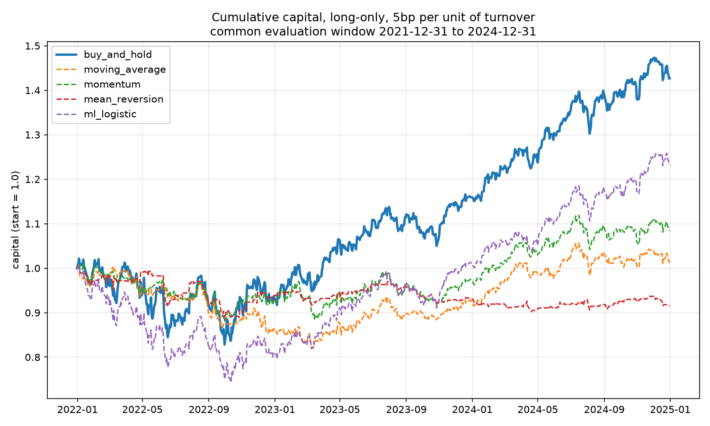

# Backtester — a test protocol, not a strategy

This repository is not an attempt to find a profitable trading rule. It is a
demonstration of how to test one without fooling yourself.

A backtest showing a Sharpe of 3 gets taken apart in ten minutes. An honest
account of *why* simple strategies fail out of sample is harder to refute and
more useful to discuss. Everything here is built so the negative result can be
trusted: the look-ahead protection sits in the engine rather than in each
strategy, the train/test split is chronological, the comparison window is the
same for every strategy, and every choice that favours the active strategies
over the passive benchmark is documented below.

Run `python main.py` to reproduce every number on this page.

## Results

Six US large caps, 2015–2024, daily. All strategies long-only, 5bp per unit of
turnover. Measured over the common evaluation window 2021-12-31 → 2024-12-31
(754 trading days).

| strategy | return %/yr | vol %/yr | sharpe | max DD % | final capital |
|---|---|---|---|---|---|
| buy_and_hold | 12.59 | 16.25 | 0.775 | -18.90 | 1.426 |
| moving_average | 0.34 | 9.86 | 0.034 | -18.31 | 1.010 |
| momentum | 2.66 | 9.63 | 0.276 | -12.93 | 1.082 |
| mean_reversion | -2.87 | 6.76 | -0.424 | -11.92 | 0.917 |
| ml_logistic | 7.22 | 14.58 | 0.495 | -26.29 | 1.232 |



**No active strategy beats holding the assets.** The interesting part is not
that they lose, but how. The three classical rules cut volatility roughly in
half (6.8–9.9% against 16.3%) because they sit in cash much of the time, and
two of them do reduce the worst drawdown. They give up far more return than
they save in risk: the best active Sharpe is 0.276 against 0.775 for the
benchmark.

The logistic model is the only strategy with a **worse** drawdown than the
benchmark (-26.29% against -18.90%) despite lower volatility. Being out of the
market part of the time made the worst loss deeper, because it was out during
the rebounds.

## What the ML model actually learned

The usual way to report this would be "directional accuracy of 0.468 to 0.537,
against 0.500 for a coin flip, so the model is no better than chance". That
benchmark is wrong, and wrong in the flattering direction. Daily equity returns
are not a balanced draw — these assets rise on about 52.8% of days over the
test window. Always predicting "up" scores 0.528 without learning anything.

Comparing the model against the correct baseline:

| asset | train up-rate | train accuracy | test up-rate | test accuracy |
|---|---|---|---|---|
| AAPL | 0.533 | 0.533 | 0.531 | 0.531 |
| MSFT | 0.543 | 0.543 | 0.516 | 0.516 |
| JPM | 0.509 | 0.512 | 0.538 | 0.537 |
| XOM | 0.495 | 0.513 | 0.528 | 0.468 |
| PG | 0.528 | 0.529 | 0.527 | 0.525 |
| SPY | 0.554 | 0.554 | 0.527 | 0.527 |

Accuracy matches the majority-class rate to within 0.002 on five of six assets,
**in-sample as well as out-of-sample**. The model is not overfitting; it is
predicting a constant. It never learned anything beyond the intercept.

The mechanism is `LogisticRegression`'s default L2 penalty with `C=1.0` applied
to unscaled features. The features are daily returns, of magnitude around 0.01,
so producing any meaningful decision boundary requires large coefficients — and
the penalty shrinks exactly those. The model collapses onto the majority class.
Standardising the features would not have found alpha, but it would have made
this failure mode less automatic, and it is the first thing to change in any
follow-up.

XOM is the informative failure. Its training window (2015–2021, covering the
2015–16 oil collapse and 2020) has a majority class of *down*: 49.5% up-days.
The test window has 52.8%. The model learned the constant "down" and carried it
into a period where the sign had flipped, scoring 0.468 — close to `1 − 0.528`.
A model whose only content is the average direction of its training sample
breaks precisely when that direction changes. On financial data, it always does.

## Method

**Universe.** AAPL, MSFT, JPM, XOM, PG, SPY. Daily adjusted prices, 2015-01-05
to 2024-12-31 (2515 trading days), log returns.

**Engine.** The signal → position shift is applied centrally in
`engine.run_backtest`, not inside each strategy. A strategy cannot introduce
look-ahead bias by forgetting to lag its own signal; the protection holds by
construction. Transaction costs are 5bp per unit of turnover.

**Strategies.** Moving-average crossover, momentum, mean reversion, and a
per-asset logistic regression predicting the sign of tomorrow's return from the
last five known returns. The ML split is chronological — the oldest 70% of
dates train, the most recent 30% test — never shuffled. Shuffling a time series
leaks the future into the training set and is the single most common way to
produce a backtest that cannot be reproduced live.

**Common window.** The model only holds positions over its test period, so
comparing its final capital against strategies that traded for ten years would
compare a 3 km runner to a 10 km one. Every strategy is measured from the first
date the model is actually active. Signals are still computed on the full
history and truncated *after* the backtest — a 50-day moving average needs the
50 preceding days, and cutting the returns first would start every strategy
blind.

**Long-only.** Buy-and-hold is 100% long at all times. Over a decade-long bull
market, a strategy allowed to go short is structurally penalised, so comparing
it directly would be holding a handicap against it. Every strategy is converted
to long-only, which asks a cleaner question: can it at least avoid the bad
stretches by stepping aside? Note this also *helps* the active strategies —
replacing -1 with 0 cuts turnover and therefore costs. The comparison is set up
in their favour and they still lose.

## Known limitations

These are real and are not corrected here.

**Survivorship bias is not corrected.** The universe is six companies chosen
because they are still listed today; correcting it would need paid
point-in-time data. The direction matters: the bias inflates the passive
benchmark, so it makes the conclusion conservative rather than convenient. If
an overstated benchmark still wins, the finding holds.

**Short evaluation window.** Three years, one broadly rising regime. Nothing
here says anything about how these rules behave in a prolonged bear market.

**Small, passive-friendly universe.** Six US large caps including an index ETF
is close to the best possible case for buy-and-hold.

**Implicit daily rebalancing.** The engine works in returns, not in amounts, so
positions are effectively reset each day. Real execution would add costs this
does not capture.

**Simplified Sharpe.** The risk-free rate is assumed to be zero, which flatters
every strategy equally over a period when it was not zero.

**Parameters are not optimised**, deliberately. Tuning lookback windows against
the same data used to evaluate them is how backtests are made to look good and
why they stop working afterwards.

**Split boundary.** `ml_logistic` computes its 70/30 split after dropping
missing values per asset, so the exact cut-off can differ by a few days between
assets. Immaterial across ~1761 and ~754 observations, but the train/test
up-rates above use a single fixed date.

## Reproducing

```bash
python -m venv .venv
.venv\Scripts\activate        # Windows;  source .venv/bin/activate on Unix
pip install -r requirements.txt
python main.py
```

`data/` is not versioned. On a fresh clone `main.py` downloads the prices from
Yahoo Finance on first run, then caches them. Expect one to two minutes.

Outputs land in `reports/`: `results.csv`, `results.md`, `ml_accuracy.md`,
`equity_curves.png`.

Dependency versions are pinned. `yfinance` in particular breaks its API between
major versions, and a repository arguing for reproducible testing should be
reproducible.

## Layout

```
main.py                  single entry point, reproduces the whole study
src/data_loader.py       download and clean prices, log returns
src/engine.py            backtest engine: signal→position shift, costs
src/strategies.py        moving average, momentum, mean reversion, logistic
src/evaluation.py        annualised return, volatility, Sharpe, max drawdown
reports/                 generated tables and chart
data/                    cached prices (not versioned)
```

Python 3.14, pandas 3.x.
